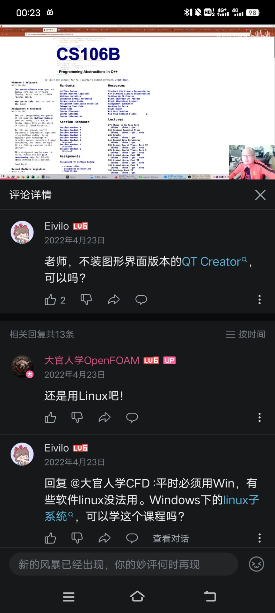
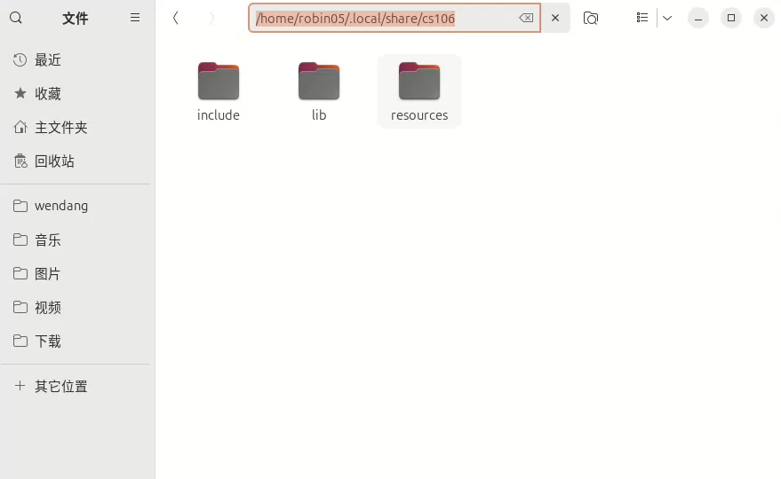

**在此感谢本文主要笔者 24级ACM俱乐部成员 robin05**

# CS106B环境配置

## 关于系统选择

请看下面这个图:

ubuntu安装教程可以参考我们站内网站教程[win系统基础上安装双系统ubuntu](https://blog.wustacm.org/wiki/csdiy/p2)

**建议：我们一般在主文件夹中创建一个 如 【cs106b】的文件夹，专门用来放置所有作业的初始文件**

## QT版本选择

**该博客发布时QT的最新版本为6.9.3**

在左侧CS自学指南目录中点击*编程入门->C++语言->CS106B/X*,然后在课程资源中找到*CS106B 2022 winter*,点击顶部栏中的*ASSIGNMENTS->About Assignments*,在第一段中找到蓝色字体的*QT Installation Guide(QT安装指南)*并点击，接着在安装QT Creator一栏中找到*Install QT Creator on linux(在linux中安装QT Creator)* ,最后跟着教程走就可以下载QT了

QT可以选择下载6.9.3版本或者6.7.2版本，必须保证所下载的版本中含有**QT Multimedia库** 

**请注意，本文后续提供的环境配置教程，都是基于读者已经自行按照cs106b作业操作后遇到问题的解决方法，所以请你先自行按照作业要求配置，如遇到无法正常编译再来寻求解决方法**

## 可能遇到的问题

当你跟着cs106作业要求配置后，大概率你在编译作业1时会出现无法正常编译的问题....这是正常的！

### 无法编译的原因

我们所要完成的是cs106b的**2021年版本**的作业。

但是在作业0当中如果你是个听话的学生，想必在安装好qt后，会跟着要求编译一次它提供的测试文件，问题就在于此，这个测试文件其实是实时更新的，也就是说，它其实是2024版的，编译它后你会在自己电脑的用户文件夹中得到一个2024版本库。不妨试着在主文件夹中如下地址打开看看

```/home/你自己的用户名/.local/share```


在上面地址中，你应该能找到一个文件夹【cs106】，这个就是你编译它提供的测试文件所产生的库，**请注意！它是2024年版**，然后！你需要将它删除！

这时候再编译作业1的初始文件仍然无法正常编译，因为你没有正确的库，刚才的最新版库已经被你删除了

请到我们的csdiy交流群的群文件中下载2021版本的测试文件，然后尝试编译这个测试文件，那么，你将成功获得2021版本的库，按照上面的地址，你又会找到文件夹【cs106】，只不过它是2021版本的。

至此，你成功完成环境配置，然后你需要将之前的作业1初始作业删除，重新下载一个全新的作业1初始代码，这时候再运行，恭喜你***Accept！***

同时你也可以直接运行其他作业了，开始快乐的完成所有作业吧！

## 莫名其妙的bug

在作业文件中
``` /home/你自己的用户名/CS106B/Assignment 1/src/GUI/GColorConsole.cpp```
你可以把97行的代码里的toShow改成toShow.str()~~虽然不建议这么做~~,然后你运行作业文件后会发现，你的run test 模块会变成白屏，无法显示错误类型~~喜欢挑战的可以逝逝~~
